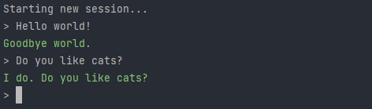

<div align="center">
    <h1>🤖・CleverBOT in Your Console・🤖</h1>
    <p>
        This module allows you to chat with Cleverbot through the command line.<br>
        Meet your new friend and have a chat with them! 😄
    </p>
    <a href="https://www.npmjs.com/package/cleverbot-console" target="_blank" title="cleverbot-console - npm" style="text-decoration:none">
        
        
        
        
        
    </a>
    <br><br>
    
</div>

## 📥 » Installation
```bash
npm install -g cleverbot-console
```

## 💎 » Usage
```bash
cleverbot <Your message>
```

## 🌠 » Example
```
cleverbot Hello World!
```

## 🔖 » Aliases
| cb | cleverbot | cleverbot-console |
|----|-----------|:------------------|

## ⭐ » Thanks
If you like this module, consider giving the [repository a star](https://github.com/sefinek24/cleverbot-console). For any questions or issues, please create a new [Issue](https://github.com/sefinek24/cleverbot-console/issues/new).